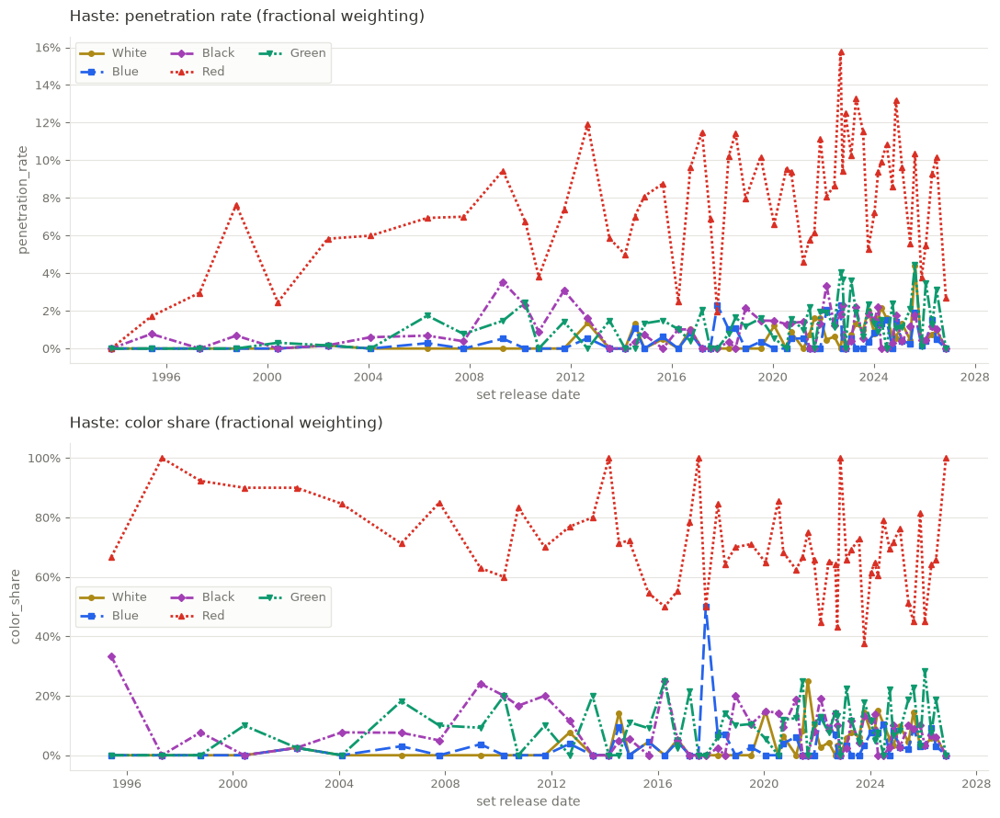
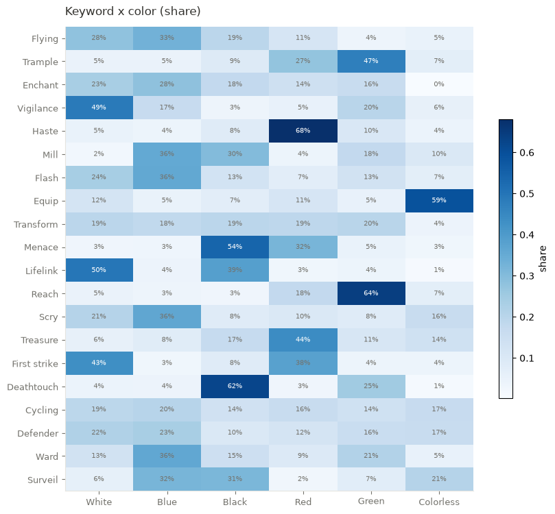
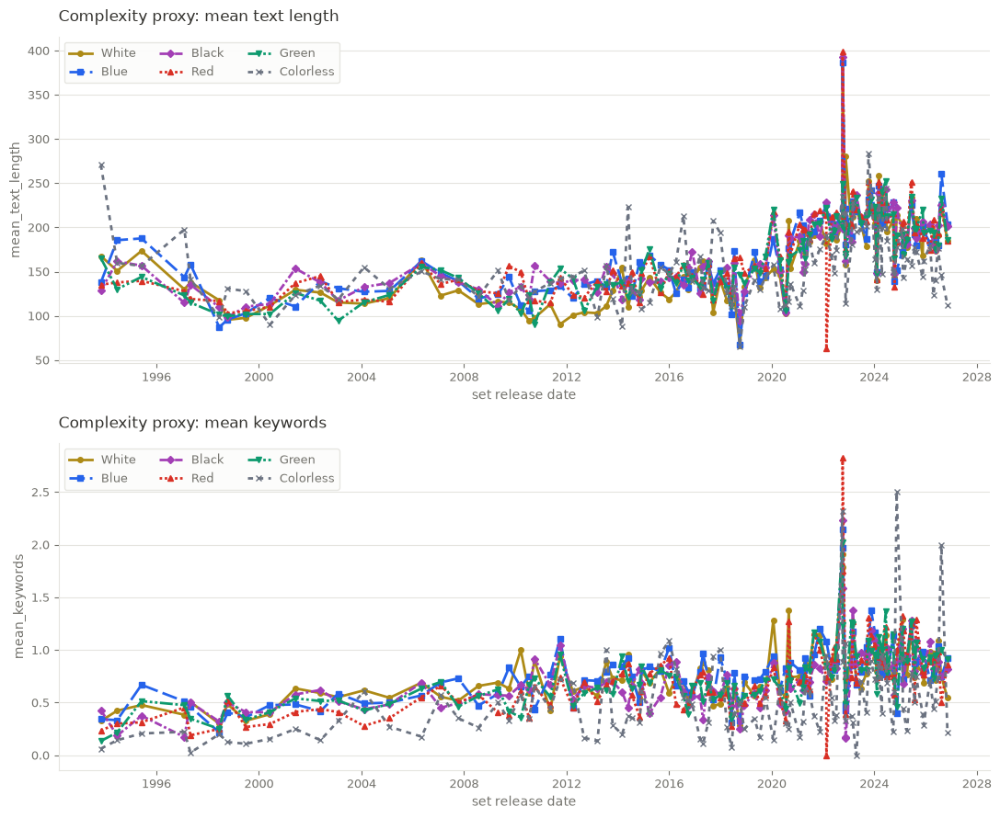

# MTG-data-analysis

A reusable, queryable dataset of every Magic: The Gathering card, built to answer one
family of questions rigorously: **which colours own which keyword mechanics, and how has
that changed over the game's history?**

Scryfall bulk data is downloaded once, parsed once into normalized Parquet tables, and
then queried repeatedly through DuckDB. It is deliberately not a script that re-scrapes or
re-derives per question — the tables are the product, and new questions are joins against
them.

Currently covering **38,633 unique cards across 574 sets**, from Alpha to the present.

## Why it is built this way

Three traps make casual "colour pie" analysis wrong, and the whole design exists to avoid
them:

1. **Multicolour attribution.** Is a Boros card a red card or a white card? Both answers
   are legitimate, so both are stored — every metric takes a `weighting` argument and
   states which one produced the number. Nothing picks silently.
2. **Share vs. penetration.** "60% of Double Strike is red" and "6% of red cards have
   Double Strike" are different claims that can move in *opposite directions*. They are
   always reported together, with the denominator.
3. **Print volume.** Magic printed ~250 cards a year in 1996 and thousands now. A raw
   count without its denominator is not a finding, so the denominator table is a
   first-class citizen.

## What it found

Red and Haste, over 574 sets — the divergence this project exists to catch:



Red's **penetration** climbs from near zero in 1996 to 8–15% of all red cards today (top),
while red's **share** of all Haste *falls* from ~90% to ~60–70% (bottom). Both are true.
Read either one alone and you get the story backwards.

The colour pie as it stands today, across the twenty most-used keywords:



Each row sums to 100%, so this compares colours *within* a keyword: Haste 68% red,
Reach 64% green, Deathtouch 62% black, Equip 59% colourless.

And a rules-bloat signal that holds across every colour — mean rules-text length roughly
doubled since 2000, with mean keyword count per card rising alongside it:



## Quick start

```bash
uv sync --all-groups
uv run mtg-analysis fetch      # Scryfall bulk data → data/raw (cached, 24h TTL)
uv run mtg-analysis build      # → data/processed/*.parquet
uv run mtg-analysis validate   # data-quality checks
uv run jupyter lab notebooks/
```

`data/` is gitignored; those two commands rebuild it from scratch in a few minutes.

## How it works

```
Scryfall bulk data      (gzipped JSON Lines, cached in data/raw, never re-downloaded
        │                inside the 24h TTL — a fresh cache makes zero HTTP calls)
        │  transform/   parse once: union multi-face cards, resolve colours,
        ▼               attach both weights, order sets by release date
5 Parquet tables        (data/processed/)
        │  analysis/db.py registers DuckDB views
        ▼
card_facts · keyword_facts · period_color_totals
        │
        ▼
metrics/ + analysis/    the eight analyses below
```

| Table | Grain |
|---|---|
| `cards` | one row per `oracle_id` — resolved colours/keywords, `first_printed_year`, `is_multiface`, `in_paper_only` |
| `card_colors` | card × colour, carrying both weighting schemes |
| `card_keywords` | card × keyword |
| `sets` | one row per set — the chronological timeline axis |
| `color_totals` | set × colour × weighting × filter — the denominator for every rate |

Ingestion and analysis are separate and idempotent: re-running an analysis never re-parses
the bulk file, and changing the time grouping never requires a rebuild.

### The two weightings

For a card with $n$ colours, each colour gets `weight_fractional` = 1/n and
`weight_inclusive` = 1.0. Fractional makes shares sum to 100% ("what share of Haste is
red"); inclusive counts a gold card fully for each colour ("how many red cards have
Haste"). Colourless cards get a single `C` row with both weights at 1.0.

### The time axis is sets, not years

One period is a run of consecutive sets in release order — not a calendar bucket. The
default groups 10 sets (`rolling_sets` in `config/config.yaml`), because 574 single-set
periods are unreadable and noisy. Grouping is applied at query time:

```python
from mtg_analysis.analysis.db import get_connection, set_period_config
from mtg_analysis.config import PeriodGroupConfig

con = get_connection("data/processed")
set_period_config(con, PeriodGroupConfig(mode="per_set"))  # or rolling_sets, any size
```

### The three metrics

```python
from mtg_analysis.metrics.core import trend_report
trend_report(con, "Double strike", "R")   # raw count, share, penetration, denominator
```

Zero denominators return `NaN`, never `0.0` — "no data" and "0% share" are different
claims.

## The eight analyses

Each is a reusable function returning a Polars DataFrame, with a separate `plot_*` helper.

| # | Analysis | Question |
|---|---|---|
| 1 | [Keyword × colour heatmap](docs/images/heatmap_keyword_colour.png) | Who owns what, over all history |
| 2 | [Time series](docs/images/timeseries_haste.png) | Penetration and share per (keyword, colour) over time |
| 3 | [Colour identity drift](docs/images/colour_drift.png) | Has a colour's toolbox shifted? (cosine similarity of keyword mixes) |
| 4 | [Pie-break tracking](docs/images/pie_break_double_strike.png) | Has a mechanic leaked out of the colour that owned it? |
| 5 | [Rarity migration](docs/images/rarity_migration_haste.png) | Is a mechanic being pushed to common, or rare-gated? |
| 6 | [Type-line crossover](docs/images/type_crossover_haste.png) | Has it moved off creatures onto spells? |
| 7 | [Complexity proxy](docs/images/complexity_by_colour.png) | Rules bloat, by colour and period |
| 8 | [Design volume](docs/images/design_volume.png) | Cards printed per colour per period — the denominator, plotted |

## Notebooks

Two notebooks walk through all eight with full explanations — what each measure is for,
which table it reads, the formula with a worked example, and the misreading each chart
invites:

- `notebooks/01_exploratory_heatmap.ipynb` — heatmap, headline numbers, time series,
  design volume. Start here; it also explains the weightings and denominators.
- `notebooks/02_trend_deep_dive.ipynb` — drift, pie-break, rarity, type crossover,
  complexity.

Rendered screenshots of both, executed against the full dataset, are in
[`docs/screenshots/`](docs/screenshots) — four images per notebook covering the whole page
([01: 1](docs/screenshots/notebook01_part1.png) · [2](docs/screenshots/notebook01_part2.png) ·
[3](docs/screenshots/notebook01_part3.png) · [4](docs/screenshots/notebook01_part4.png) ·
[02: 1](docs/screenshots/notebook02_part1.png) · [2](docs/screenshots/notebook02_part2.png) ·
[3](docs/screenshots/notebook02_part3.png) · [4](docs/screenshots/notebook02_part4.png)).

## Status

Working and verified against live Scryfall data: 75 tests pass, ruff clean, `validate`
passes on all 38,633 cards with zero parser drops across every awkward layout (transform,
modal DFC, split, adventure, meld, art series).

Known gaps and next steps are tracked in [`docs/HANDOFF.md`](docs/HANDOFF.md). The largest
is that sparse keywords — anything with only a handful of appearances — interact badly
with fine-grained periods in the pie-break analysis.

## Future work

`src/mtg_analysis/extensions/` is stubbed with the intended shape, not implemented:
informal mechanic mining over `oracle_text` (impulse draw, rummaging) and functional
categorisation (removal, ramp, card draw). Both would emit `(oracle_id, mechanic)` rows so
they plug into the existing `color_totals` rate math unchanged.

## Development

```bash
uv run pytest
uv run ruff check .
```

Agent-oriented notes on the invariants that must not break live in
[`CLAUDE.md`](CLAUDE.md).

Card data from [Scryfall](https://scryfall.com). Bulk endpoint only, cached locally,
descriptive User-Agent — please keep it that way if you fork this.
